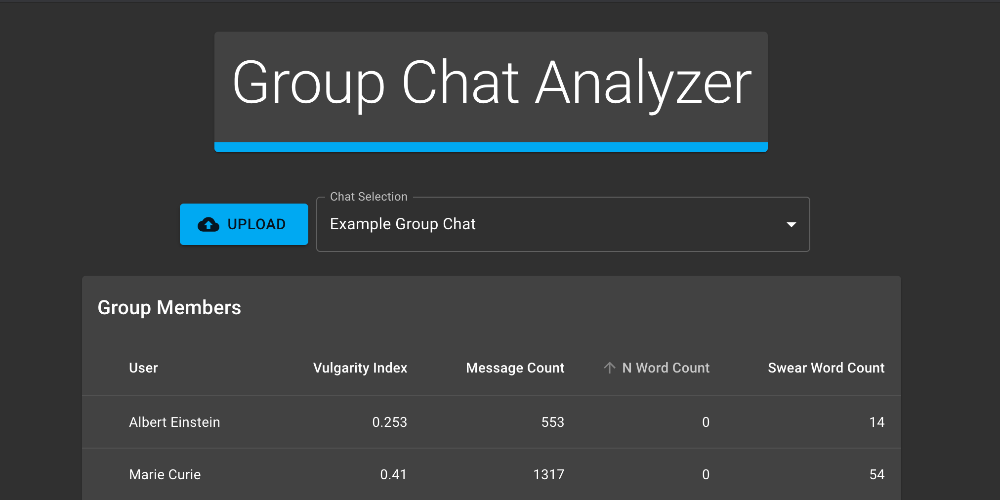

# Group Chat Analyzer

This project was built to read JSON data from Facebook Messenger group chats to analyze important information. The main features include swear word counter, number of messages, and charts to visualize data.

## DISCLAIMER

Data found on this app is not an accurate represent of any chat records as the JSON files can easily be manipulated.

## Getting Started

Visit https://mxinburritos.github.io/group-chat-analyzer/ to use the application.

Table lists all users detected in the JSON file and provide information like message count and other metrics in each respective row.

Each user will display several graphs which helps to visualize data.

### Setup

After cloning, run `npm i && npm start`

## Built With

- [ReactJS](https://reactjs.org/) - JavaScript Library used
- [react-chartjs-2](https://jerairrest.github.io/react-chartjs-2/) - React wrapper for chartjs

## License

This project is licensed under the MIT License - see the

## TODO

- [x] Display graphs of data
- [x] Change table headers
- [x] Added Frequency Graph
- [x] Add way to upload JSON files
- [ ] Create JSON processing API
- [ ] OPTIONAL: Add user login
- [ ] OPTIONAL: Process other platforms
